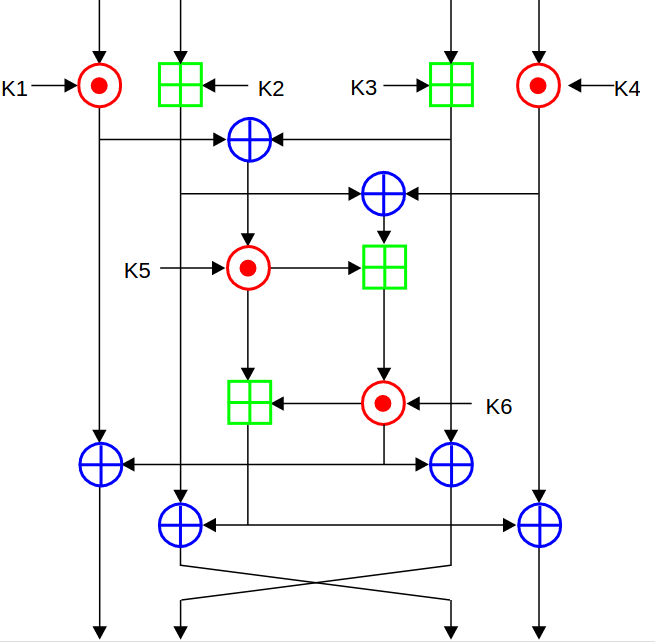

# [IDEA](https://github.com/LSantos06/SystemC_IDEA)
### Trabalho Final de Modelagem de Sistemas em Silício 1/2017
O trabalho consiste em implementar, utilizando a linguagem _SystemC_, um módulo de criptografia que utiliza o __IDEA__ (_International Data Encryption Algorithm_) que é um algoritmo de cifra de bloco (simétrica) que faz uso de chaves de 128 bits e que tem uma estrutura semelhante ao _DES_.

  
   
  <t><b>Figura 1</b>: Um round de criptografia do IDEA.</t>
   

O algoritmo é usado tanto para a cifragem quanto para a decifração e, como outras cifras de bloco, usa a _confusão_ e a _difusão_ para produzir o texto cifrado. A filosofia que norteou este projeto foi "misturar operações de grupos algébricos diferentes". O _IDEA_ possui três grupos algébricos cujas operações são misturadas. Estas operações, que podem ser facilmente implementadas via hardware e/ou software, são:
-  `Multiplicação módulo 2¹⁶+1 (multiplicação ignorando qualquer overflow);`
-  `Adição módulo 2¹⁶ (adição ignorando qualquer overflow);`
-  `Xor.`

Todas estas operações são feitas com blocos de 16 bits, o que faz com que este algoritmo também seja eficiente em processadores de 16 bits.
