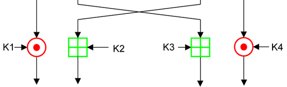

# [IDEA](https://github.com/LSantos06/SystemC_IDEA)
## Trabalho Final de Modelagem de Sistemas em Silício 1/2017
O trabalho consiste em implementar, utilizando a linguagem _SystemC_, um módulo de criptografia que utiliza o __IDEA__ (_International Data Encryption Algorithm_) que é um algoritmo de cifra de bloco (simétrica) que faz uso de uma _chave secreta_ de 128 bits e tanto o _texto legível_ (entrada) quanto o _texto ilegível_ (saída) possuem 64 bits. O algoritmo é usado tanto para a cifragem quanto para a decifragem.

#### Operações Básicas
O _IDEA_ possui três grupos algébricos cujas operações são misturadas. Estas operações, que podem ser facilmente implementadas via hardware e/ou software, são:
-  `Multiplicação módulo 2¹⁶+1 (multiplicação ignorando qualquer overflow);`
-  `Adição módulo 2¹⁶ (adição ignorando qualquer overflow);`
-  `Xor.`

Todas estas operações são feitas com blocos de 16 bits, o que faz com que este algoritmo também seja eficiente em processadores de 16 bits.

#### Geração das sub-chaves
A partir da _chave secreta_ de 128 bits, são geradas 52 _sub-chaves_ de 16 bits. Cada _round_ utiliza 6 _sub-chaves_, totalizando 48 _sub-chaves_, mais 4 _sub-chaves_ são geradas para a realização do _half-round_.

#### Round e Half-round

  
   
  <t><b>Figura 1</b>: Um <i>round</i> de criptografia do IDEA (Repetido 8 vezes).</t>
   

  
   
  <t><b>Figura 2</b>: <i>Round final</i> (<i>half-round</i>) de criptografia do IDEA.</t>
   

#### Grupo
* Lucas Avelino
  * Matrícula: 13/0013072
  * GitHub: [lucasavelino](https://github.com/lucasavelino)
* Lucas Nascimento
  * Matrícula: 14/0151010
  * GitHub: [LSantos06](https://github.com/LSantos06)
